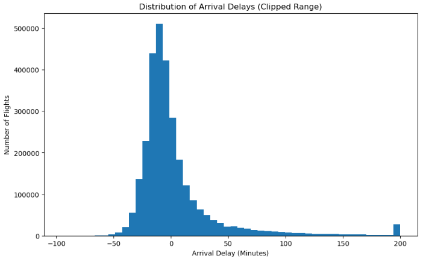
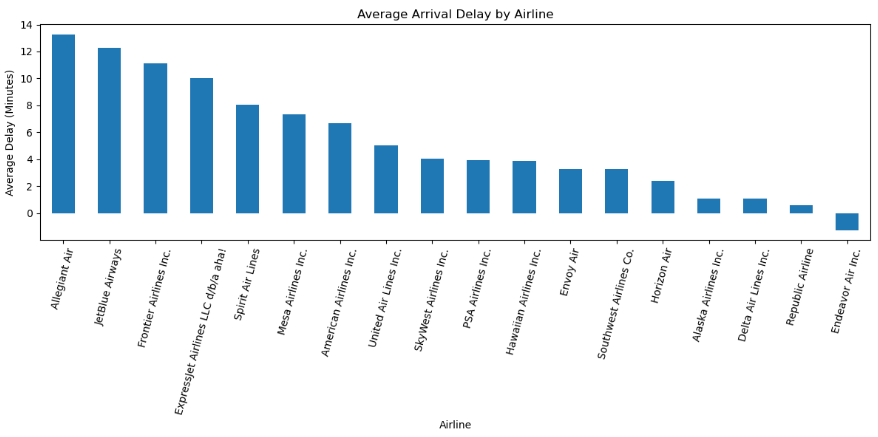
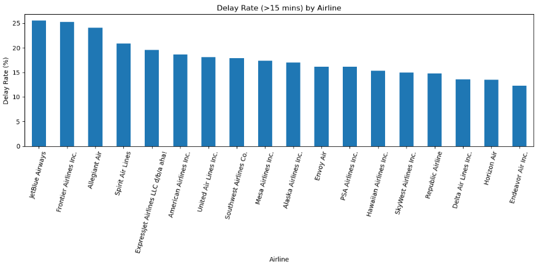
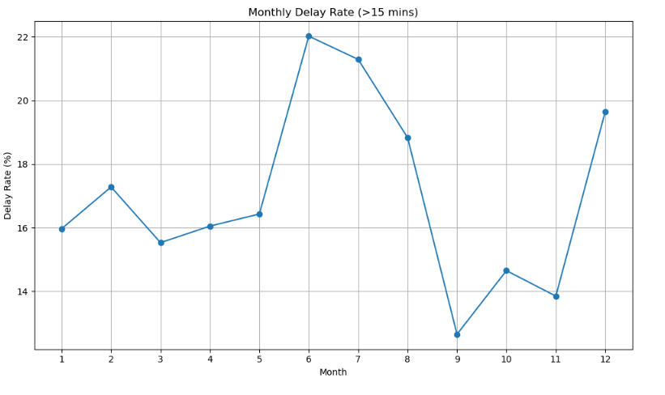
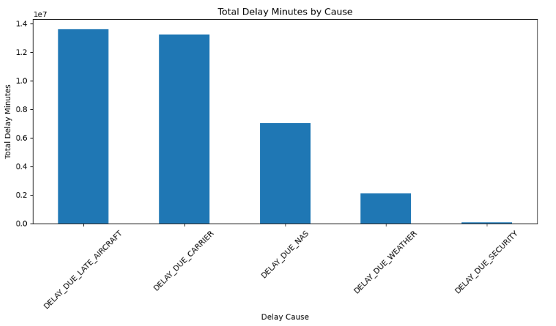

# Flight Delays & Cancellations Analysis

### Data-Driven Insights into Airline Operational Performance


## Project Overview

This project performs **Exploratory Data Analysis (EDA)** on over **3 million flight records**.

The objective is to uncover **operational inefficiencies**, **seasonal trends**, and the **primary causes of flight delays** in order to generate actionable business insights.


## Objectives

- **Measure** flight cancellation and delay rates  
- **Compare** airline performance  
- **Identify** seasonal delay trends  
- **Analyze** root causes of delays  
- **Derive** business recommendations  


## Project Structure

```
ds-project-eda-flight-delays-cancellations/
│
├── data/
│   └── raw/                          # Raw dataset (ignored via .gitignore)
│
├── notebooks/
│   └── 01_eda_flight_delays.ipynb    # Main analysis notebook
│
├── images/
│   ├── arrival_delay_distribution.png
│   ├── average_delay_by_airline.png
│   ├── delay_rate_by_airline_percentage.png
│   ├── monthly_delay_trend.png
│   └── delay_causes_contribution.png
│
├── README.md
└── .gitignore
```


## Key Findings

- **17% of flights** experience significant delays (>15 minutes).  
- Only **~2.6% of flights** are cancelled.  
- **Late aircraft delays** and **carrier-related delays** are the largest contributors to total delay minutes.  
- Clear **seasonal patterns** exist, with peak delays in **June, July, and December**.  
- Airline performance varies significantly across carriers.  


## Delay Cause Contribution

Operational issues dominate total delay minutes:

1. **Late Aircraft Delays**  
2. **Carrier Delays**  
3. **NAS (Air Traffic Control) Delays**  
4. **Weather Delays**  
5. **Security Delays**

This indicates that **internal operational efficiency improvements** could significantly reduce delays.


## 📊 Sample Visualizations

### Distribution of Arrival Delays


### Average Arrival Delay by Airline


### Delay Rate (>15 mins) by Airline


### Monthly Delay Trend


### Delay Cause Contribution



## Tools & Technologies

- Python  
- Pandas  
- Matplotlib  
- Jupyter Notebook  


## Business Implications

The analysis suggests that:

- Improving **aircraft turnaround efficiency** could reduce cascading delays.  
- Better scheduling during **peak summer months** may enhance punctuality.  
- Operational process improvements may yield greater benefits than focusing solely on weather-related disruptions.  


## Future Enhancements

- Build a predictive model for delay forecasting  
- Perform airport-level performance comparison  
- Conduct weather-impact modeling  
- Develop an interactive dashboard using Power BI or Tableau  


## Author

**Tejas Panhale**  
Aspiring Data Analyst | Python | Exploratory Data Analysis
